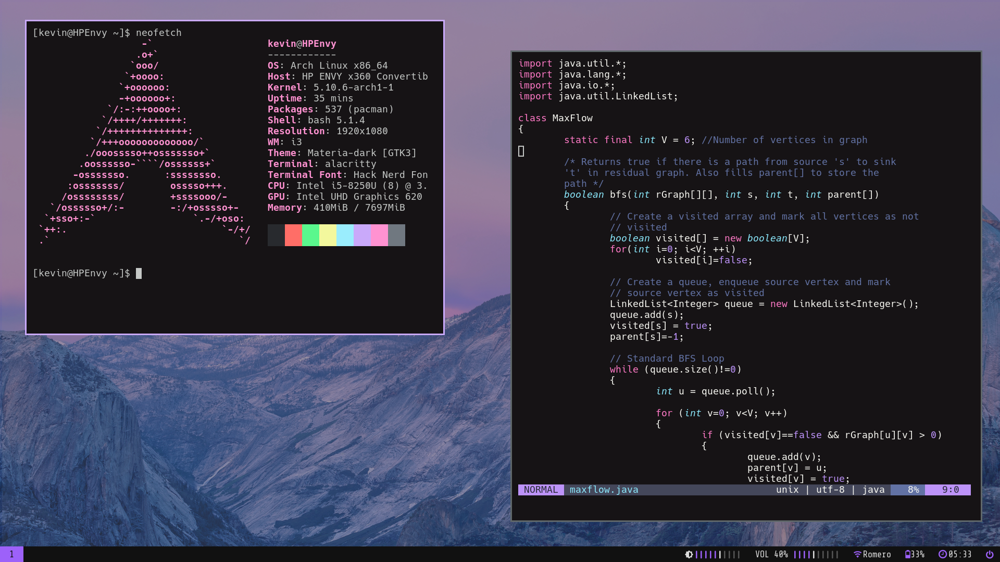

Reinstalled Arch for the new year with a more cohesive colorscheme and better workflow. I am also using this as a "save point" in addition to my snapshots in case I end up breaking my config in some way.

Eventually I plan on adding my zathura config as well as spotify + spicetify.

- **OS:** Arch Linux
- **WM:** i3-gaps
- **Terminal:** Alacritty
- **Editor:** Neovim + vim-plug

# Screenshots
---

